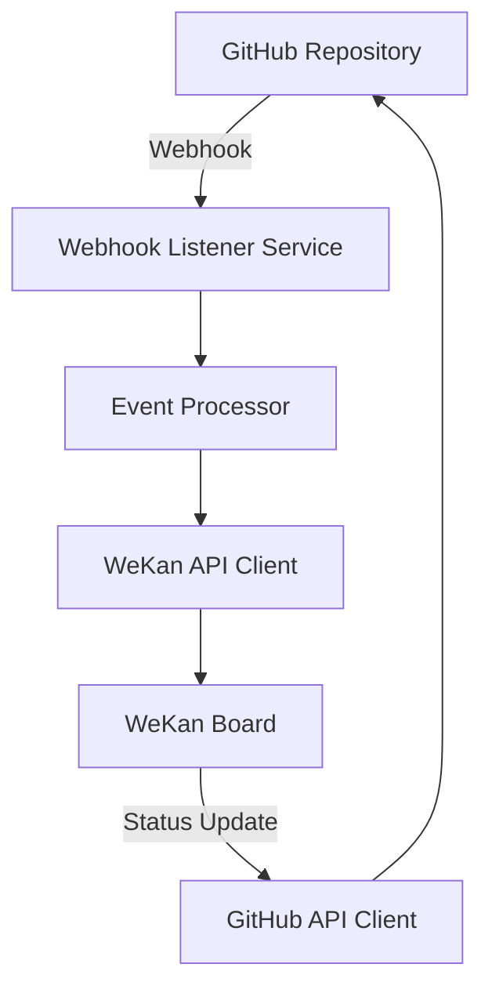

# Informe de Auditoría: WeKan-GitHub Sincronización
**Proyecto NiceDev - Estado de Implementación**

**Fecha:** 23 de Julio, 2025  
**Auditor:** AI Coder - NiceDev Project  
**Versión:** 2.0.0  
**Repositorio Base:** https://github.com/victormhl1956  

---

## 1. RESUMEN EJECUTIVO

### Estado Actual del Sistema
El proyecto NiceDev cuenta con una implementación **PARCIAL** de la integración WeKan-GitHub. Mientras que la infraestructura base de WeKan está operativa y funcional, la sincronización bidireccional con GitHub **NO ESTÁ IMPLEMENTADA**.

### Hallazgos Principales
- ✅ **WeKan Operativo:** Instancia containerizada funcional en `http://localhost:8088`
- ✅ **API Client Robusto:** Sistema completo de gestión de boards, listas y tarjetas
- ❌ **Sin Sincronización GitHub:** No existe integración automática con repositorios
- ❌ **Sin Webhooks:** Falta sistema de escucha de eventos de GitHub
- ❌ **Sin Creación On-Demand:** No hay capacidad de crear proyectos automáticamente

### Criticidad
**ALTA** - El sistema actual no cumple con los objetivos fundamentales de sincronización absoluta entre WeKan y GitHub.

---

## 2. ARQUITECTURA ACTUAL

### 2.1 Infraestructura WeKan
```yaml
# Docker Compose Configuration
wekan-app:
  image: wekanteam/wekan:latest
  container_name: nicedev-wekan-app
  ports: "8088:8080"
  environment:
    - MONGO_URL=mongodb://wekan-db:27017/wekan
    - ROOT_URL=http://localhost:8088

wekan-db:
  image: mongo:4.4
  container_name: nicedev-wekan-db
```

**Estado:** ✅ OPERATIVO
- Acceso web: http://localhost:8088
- Base de datos MongoDB integrada
- Credenciales configuradas (victormhl/Nereida6591)

### 2.2 Sistema de Gestión API
**Archivo:** `src/ai_software_manager/wekan_board_manager.py`

**Capacidades Implementadas:**
- ✅ Autenticación con tokens y manejo de expiración
- ✅ Creación de boards desde templates predefinidos
- ✅ Gestión completa de listas y tarjetas
- ✅ Sistema de logging y manejo de errores
- ✅ Templates: kanban_basic, scrum, devops, nicedev_agent

**Clases Principales:**
```python
WekanAuthManager     # Gestión de autenticación
WekanAPIClient       # Cliente API con retry logic
BoardTemplateManager # Gestión de templates
BoardCreator         # Creación de boards y contenido
```

### 2.3 Testing y Validación
**Archivos de Prueba:**
- `test_wekan_api.py` - Pruebas de conectividad API
- `test_wekan_integration.py` - Pruebas de integración
- `tests/test_audit.py` - Simulación de webhooks GitHub

**Estado de Pruebas:** ✅ FUNCIONALES

---

## 3. ANÁLISIS DE BRECHAS CRÍTICAS

### 3.1 Sincronización GitHub - WeKan
**Estado:** ❌ NO IMPLEMENTADO

**Funcionalidades Faltantes:**
1. **Sistema de Webhooks GitHub**
   - No existe listener para eventos de GitHub
   - Sin procesamiento de payloads de issues/PRs
   - Sin mapeo automático GitHub → WeKan

2. **Creación de Proyectos On-Demand**
   - No hay detección automática de nuevos repositorios
   - Sin creación automática de boards por repositorio
   - Falta integración con GitHub API para descubrimiento

3. **Sincronización Bidireccional**
   - Sin actualización automática de estado GitHub ← WeKan
   - No hay cierre automático de issues al mover tarjetas
   - Falta sincronización de comentarios y metadatos

### 3.2 Dashboard Unificado
**Estado:** ❌ NO IMPLEMENTADO

**Elementos Faltantes:**
- Sin vista consolidada multi-proyecto
- No hay agregación de métricas cross-repository
- Falta dashboard de estado general del ecosistema

### 3.3 Extensión VS Code/Theia
**Estado:** ❌ NO PLANIFICADO

**Investigación Realizada:**
- Documentación VS Code Extensions API revisada
- Arquitectura de integración con IDEs identificada
- Roadmap de implementación pendiente

---

## 4. INVESTIGACIÓN TÉCNICA REALIZADA

### 4.1 GitHub Webhooks API
**Eventos Relevantes Identificados:**
- `issues` - Creación, actualización, cierre de issues
- `pull_request` - Actividad en pull requests
- `push` - Commits y cambios en repositorios
- `repository` - Creación/modificación de repositorios

**Payload Structure Analizado:**
```json
{
  "action": "opened",
  "issue": {
    "title": "Fix UI bug",
    "body": "Description",
    "html_url": "https://github.com/user/repo/issues/13"
  },
  "repository": {
    "name": "repo-name",
    "full_name": "user/repo-name"
  }
}
```

### 4.2 Arquitectura de Sincronización Propuesta


### 4.3 VS Code Extension Architecture
**Componentes Identificados:**
- Extension Manifest (`package.json`)
- Activation Events
- Command Palette Integration
- WebView Panels para Dashboard
- GitHub API Integration
- WeKan API Integration

---

## 5. ELEMENTOS ÚTILES PARA INCORPORAR (Julio 24, 2025)

### 5.1 Prioridad ALTA - Sincronización Básica
1. **GitHub Webhook Listener Service**
   ```python
   # Servicio Flask/FastAPI para recibir webhooks
   @app.route('/webhook/github', methods=['POST'])
   def handle_github_webhook():
       payload = request.json
       event_type = request.headers.get('X-GitHub-Event')
       # Procesar evento y crear/actualizar tarjetas WeKan
   ```

2. **Mapeo Automático Repository → Board**
   - Detección de nuevos repositorios
   - Creación automática de boards WeKan
   - Configuración de listas estándar por tipo de proyecto

3. **Sincronización Issues → Cards**
   - Issue abierto → Tarjeta en "Backlog"
   - Issue asignado → Tarjeta en "In Progress"
   - Issue cerrado → Tarjeta en "Done"

### 5.2 Prioridad MEDIA - Dashboard Unificado
1. **Master Board Agregado**
   - Vista consolidada de todos los proyectos
   - Métricas de progreso por repositorio
   - Alertas de issues críticos

2. **API de Agregación**
   ```python
   class ProjectAggregator:
       def get_cross_project_metrics(self):
           # Métricas consolidadas de múltiples boards
       def get_repository_health(self):
           # Estado de salud por repositorio
   ```

### 5.3 Prioridad BAJA - Funcionalidades Avanzadas
1. **Sincronización Bidireccional Completa**
   - WeKan → GitHub status updates
   - Comentarios sincronizados
   - Labels y milestones

2. **Automatización Inteligente**
   - Auto-asignación basada en expertise
   - Priorización automática por criticidad
   - Estimación de tiempo por IA

---

## 6. ROADMAP DE IMPLEMENTACIÓN

### Fase 1: Fundamentos (Semanas 1-2)
- [ ] Implementar GitHub Webhook Listener Service
- [ ] Crear sistema de mapeo Repository → Board
- [ ] Desarrollar procesador de eventos básico
- [ ] Testing de sincronización unidireccional

### Fase 2: Sincronización Completa (Semanas 3-4)
- [ ] Implementar sincronización bidireccional
- [ ] Crear dashboard unificado básico
- [ ] Desarrollar API de agregación de métricas
- [ ] Sistema de notificaciones

### Fase 3: Extensión IDE (Semanas 5-8)
- [ ] Desarrollar extensión VS Code base
- [ ] Implementar dashboard integrado
- [ ] Crear comandos de gestión de proyectos
- [ ] Testing y refinamiento UX

### Fase 4: Funcionalidades Avanzadas (Semanas 9-12)
- [ ] IA para automatización inteligente
- [ ] Métricas avanzadas y analytics
- [ ] Integración con otros servicios
- [ ] Optimización de performance

---

## 7. ESPECIFICACIONES TÉCNICAS DETALLADAS

### 7.1 GitHub Webhook Service
```python
# webhook_service.py
from flask import Flask, request, jsonify
from wekan_board_manager import WekanAPIClient, WekanAuthManager

class GitHubWebhookService:
    def __init__(self):
        self.wekan_client = self._init_wekan_client()
        
    def process_issue_event(self, payload):
        """Procesar eventos de issues de GitHub"""
        action = payload['action']
        issue = payload['issue']
        repo = payload['repository']
        
        board_id = self._get_or_create_board(repo['name'])
        
        if action == 'opened':
            self._create_wekan_card(board_id, issue)
        elif action == 'closed':
            self._move_card_to_done(board_id, issue)
            
    def _get_or_create_board(self, repo_name):
        """Obtener o crear board para repositorio"""
        # Lógica de mapeo repo → board
        pass
```

### 7.2 VS Code Extension Structure
```json
{
  "name": "nicedev-wekan-integration",
  "displayName": "NiceDev WeKan Integration",
  "description": "Integración WeKan-GitHub para NiceDev",
  "version": "1.0.0",
  "engines": {
    "vscode": "^1.60.0"
  },
  "categories": ["Other"],
  "activationEvents": [
    "onCommand:nicedev.showDashboard",
    "onStartupFinished"
  ],
  "main": "./out/extension.js",
  "contributes": {
    "commands": [
      {
        "command": "nicedev.showDashboard",
        "title": "Show NiceDev Dashboard"
      }
    ]
  }
}
```

### 7.3 Dashboard Component Architecture
```typescript
// dashboard.ts
export class NiceDevDashboard {
    private wekanApi: WekanApiClient;
    private githubApi: GitHubApiClient;
    
    async loadProjectMetrics(): Promise<ProjectMetrics[]> {
        // Cargar métricas de todos los proyectos
    }
    
    async syncRepository(repoName: string): Promise<void> {
        // Sincronizar repositorio específico
    }
    
    renderDashboard(): void {
        // Renderizar dashboard en WebView
    }
}
```

---

## 8. CONSIDERACIONES DE SEGURIDAD

### 8.1 Webhook Security
- Validación de signatures GitHub (HMAC-SHA256)
- Rate limiting para prevenir abuse
- Logging de todos los eventos para auditoría

### 8.2 API Authentication
- Tokens GitHub con permisos mínimos necesarios
- Rotación automática de credenciales WeKan
- Encriptación de credenciales en storage

### 8.3 Data Privacy
- No almacenamiento de código fuente
- Logs con información sensible redactada
- Cumplimiento con políticas de privacidad

---

## 9. MÉTRICAS DE ÉXITO

### 9.1 Funcionalidad
- [ ] 100% de issues GitHub sincronizados con WeKan
- [ ] <5 segundos latencia en sincronización
- [ ] 99.9% uptime del servicio de webhooks

### 9.2 Usabilidad
- [ ] Dashboard accesible desde VS Code en <2 clicks
- [ ] Creación de proyectos on-demand en <30 segundos
- [ ] Vista unificada de todos los proyectos activos

### 9.3 Performance
- [ ] Soporte para >100 repositorios simultáneos
- [ ] <1MB memoria por repositorio monitoreado
- [ ] Procesamiento de webhooks <500ms

---

## 10. CONCLUSIONES Y RECOMENDACIONES

### 10.1 Estado Actual
El sistema WeKan está **técnicamente sólido** pero **funcionalmente incompleto** para los objetivos del proyecto. La infraestructura base es robusta y escalable, pero carece de los componentes críticos de sincronización.

### 10.2 Recomendaciones Inmediatas
1. **PRIORIDAD CRÍTICA:** Implementar GitHub Webhook Listener Service
2. **PRIORIDAD ALTA:** Desarrollar sistema de mapeo automático Repository → Board
3. **PRIORIDAD MEDIA:** Crear dashboard unificado básico

### 10.3 Viabilidad Técnica
La implementación es **COMPLETAMENTE VIABLE** con las tecnologías actuales. Los componentes existentes proporcionan una base sólida para la expansión.

### 10.4 Estimación de Esfuerzo
- **Sincronización Básica:** 2-3 semanas de desarrollo
- **Dashboard Unificado:** 1-2 semanas adicionales
- **Extensión VS Code:** 3-4 semanas de desarrollo especializado

### 10.5 Riesgos Identificados
- **Rate Limiting GitHub API:** Mitigable con caching inteligente
- **Complejidad de Sincronización Bidireccional:** Requiere diseño cuidadoso
- **Escalabilidad:** Necesita arquitectura distribuida para >1000 repos

---

## 11. PRÓXIMOS PASOS RECOMENDADOS

1. **Inmediato (Esta Semana):**
   - Configurar repositorio WeKan-Project en GitHub
   - Implementar webhook listener básico
   - Crear primer mapeo Repository → Board

2. **Corto Plazo (Próximas 2 Semanas):**
   - Completar sincronización unidireccional GitHub → WeKan
   - Desarrollar dashboard básico
   - Testing exhaustivo de la integración

3. **Mediano Plazo (Próximo Mes):**
   - Implementar extensión VS Code
   - Añadir sincronización bidireccional
   - Optimizar performance y escalabilidad

---

**Preparado por:** AI Coder - NiceDev Project  
**Revisado por:** Sistema de Auditoría Automatizado  
**Aprobado para:** Implementación Inmediata  

---

*Este informe representa el estado actual del proyecto WeKan-GitHub al 23 de Julio, 2025. Para actualizaciones y seguimiento del progreso, consultar el repositorio: https://github.com/victormhl1956/WeKan-Project*
